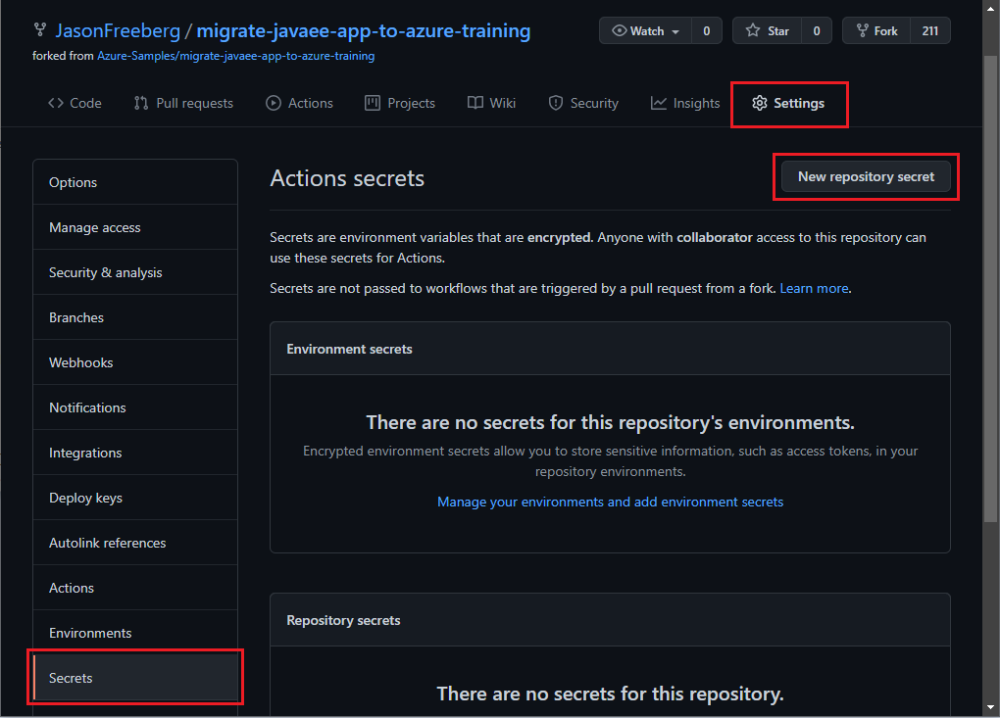
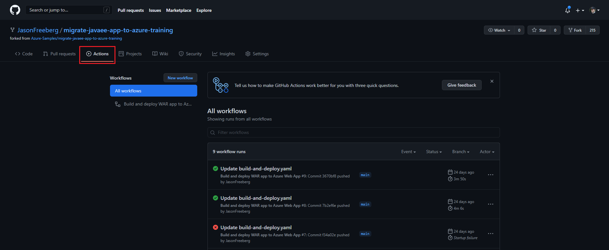
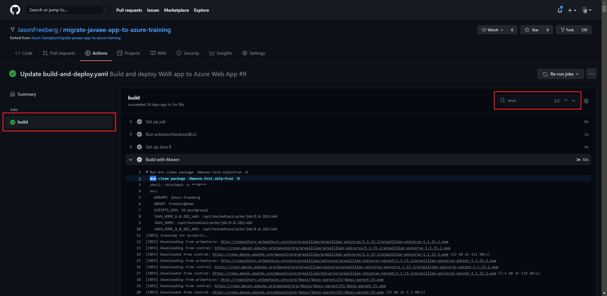

# 05 - Setup GitHub Actions

__This guide is part of the [migrate Java EE app to Azure training](../README.md)__

How to setup a GitHub Actions workflow file and the necessary secrets to continuously deploy your Java EE app.

## Overview of GitHub Actions

GitHub Actions is an automation framework with CI/CD built-in and makes it easy to automate your software development workflows. Your automation can be triggered on events like when a commit is pushed, a comment is made, a pull request is opened, or on a schedule. These workflows are stored as `.yml` files in the `.github/workflows` directory of your repository. In this module, you will learn how to define a workflow to build and deploy a Java EE app whenever there is a push on the main branch of the repository.

> See the [GitHub Actions documentation](https://docs.github.com/actions) for more information.

## Set secrets on GitHub

The job that deploys our application will use the Azure CLI, so you will need to provide GitHub Actions with a Service Principal so that the job can authenticate the Azure CLI.

1. Run the shell commands below to create a Service Principal; replace the placeholders with your app name, resource group, subscription ID, and provide a memorable name for the Service Principal.

    ```bash
    SP_NAME="replace-this-with-a-name"
    APP_NAME="replace-with-your-webapp-name"
    RESOURCE_GROUP="your-resource-group"
    SUBSCRIPTION="your-subscription-id"

    az ad sp create-for-rbac --name $SP_NAME --sdk-auth --role contributor \
      --scopes /subscriptions/$SUBSCRIPTION/resourceGroups/$RESOURCE_GROUP/providers/Microsoft.Web/sites/$APP_NAME
    ```

2. The Azure CLI command will output a JSON object with the Service Principal ID, access token, and other authentication information. Copy this JSON object.
3. Open your browser to the GitHub Repository. Click **Settings** > **Secrets** > **New repository secrets**
4. Paste the JSON object into a secret named **AZURE_CLI_CREDENTIALS**. The workflow file will reference this secret.

    

> For more information on using Service Principals with GitHub Actions, see [this article](https://github.com/Azure/login#configure-deployment-credentials).

## The workflow file

The workflow shown below builds and deploys the WAR file and datasource configuration files. Copy and paste this as a new file into the `.github/workflows/` directory. Replace `your-webapp-name` with the name of your Azure webapp, replace `your-resource-group` with the resource group containing your app. If you used MySQL or Azure SQL, replace `3A-postgresql` with `3B-mysql` or `3C-sql` respectively. Save the file as `build-and-deploy.yml`.

```yaml
# Docs for the Azure Web Apps Deploy action: https://github.com/Azure/webapps-deploy
# More GitHub Actions for Azure: https://github.com/Azure/actions

name: Build and deploy WAR app to Azure Web App

on:
  push:
    branches:
      - master
      - main
  workflow_dispatch:

env:
  WEBAPP: your-webapp-name   # Replace with your JBoss site's name
  GROUP: your-resource-group  # Replace with the resource group containing your JBoss EAP site
  SCRIPTS_DIR: 3A-postgresql  # Replace this with 3B-mysql or 3C-sql if you used MySQL or SQL

jobs:
  build-and-deploy:
    runs-on: ubuntu-latest

    steps:
    - uses: actions/checkout@v2

    - name: Set up Java 8
      uses: actions/setup-java@v1
      with:
        java-version: '8'

    - name: Build with Maven
      run: mvn -B clean package -Dmaven.test.skip=true 

    - name: Azure Login
      uses: azure/login@v1
      with:
        creds: ${{ secrets.AZURE_CLI_CREDENTIALS }}

    - name: zip the database artifacts
      run: zip -r db_files.zip .scripts/$SCRIPTS_DIR
    
    - name: Deploy data source artifacts
      uses: azure/CLI@v1
      with:
        azcliversion: 2.19.1
        inlineScript: |
          az extension add --name webapp
          
          az webapp deploy --resource-group $GROUP --name $WEBAPP \
            --src-path db_files.zip --target-path "/home/site/deployments/tools" --restart false --type zip 
      
    - name: Deploy WAR file
      uses: azure/webapps-deploy@v2
      with:
        app-name: ${{ env.WEBAPP }}
        package: target/applicationPetstore.war
```

>🚧 - __Preview-specific__. The [`az webapp deploy`](https://docs.microsoft.com/cli/azure/ext/webapp/webapp?view=azure-cli-latest#ext_webapp_az_webapp_deploy) command is currently included as an extension in the Azure CLI. In the near future it will be available in the core Azure CLI commands.

This workflow file consists of a single job that builds the `.war` application with Maven, then zips the database connection configuration files and driver. Finally, all the artifacts are uploaded to the web app using the Azure CLI [`az webapp deploy`](https://docs.microsoft.com/cli/azure/ext/webapp/webapp?view=azure-cli-latest#ext_webapp_az_webapp_deploy) command.

This job is triggered whenever there is a push on the master branch, or it can be manually triggered using the GitHub web UI or API (via the `workflow_dispatch` trigger). For a full list of GitHub Actions triggers, see [this doc article](https://docs.github.com/actions/reference/events-that-trigger-workflows).

## Add Continuous Integration checks for Pull Requests (Optional)

You can create a second workflow to build the application whenever a Pull Request is opened on the repository. This will automate part of the testing process for every proposed contribution, saving time and manual effort. An example workflow for this is shown below. You can save this as a new workflow file in the `.github/workflows/` directory. This workflow does **not** deploy the application. 

```yml
name: Java CI with Maven

on:
  pull_request:
    branches: [ master ]  # You can specify other branches as well, such as "dev" if you have such a branch.

jobs:
  build:

    runs-on: ubuntu-latest

    steps:
    - uses: actions/checkout@v2

    - name: Set up Java 8
      uses: actions/setup-java@v1
      with:
        java-version: 8
    
    - name: Build with Maven
      run: mvn -B clean package -Dmaven.test.skip=true
```

## View workflow runs in GitHub

To view the progress of your workflow run and its logs, open the **Actions** tab at the top of the repository. The left-side menu shows a list of the workflows in the repository, select a workflow to narrow the workflow runs that are shown in the middle. 



To view the logs of a specific workflow run, click it from the list. The following page will show all of the jobs within the workflow. Next, select a job on the left side. The page will now show a list of all the steps in that job. From here, you can expand a job to view the logs and use the search bar on the top-right to search the commands and output.



---

⬅️ Previous guide: [Step 04 - Monitor Java EE Application](../step-04-monitor-java-ee-app/README.md)

➡️ Next guide: [Conclusion](../step-99-conclusion/README.md)
